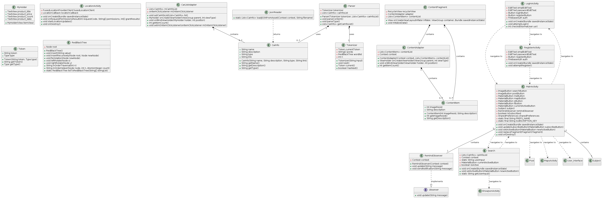

# [G12 - Glow] Report

The following is a report template to help your team successfully provide all the details necessary for your report in a structured and organised manner. Please give a straightforward and concise report that best demonstrates your project. Note that a good report will give a better impression of your project to the reviewers.

Note that you should have removed ALL TEMPLATE/INSTRUCTION textes in your submission (like the current sentence), otherwise it hampers the professionality in your documentation.

*Here are some tips to write a good report:*

* `Bullet points` are allowed and strongly encouraged for this report. Try to summarise and list the highlights of your project (rather than give long paragraphs).*

* *Try to create `diagrams` for parts that could greatly benefit from it.*

* *Try to make your report `well structured`, which is easier for the reviewers to capture the necessary information.*

*We give instructions enclosed in square brackets [...] and examples for each sections to demonstrate what are expected for your project report. Note that they only provide part of the skeleton and your description should be more content-rich. Quick references about markdown by [CommonMark](https://commonmark.org/help/)*

## Table of Contents

1. [Team Members and Roles](#team-members-and-roles)
2. [Summary of Individual Contributions](#summary-of-individual-contributions)
3. [Application Description](#application-description)
4. [Application UML](#application-uml)
5. [Application Design and Decisions](#application-design-and-decisions)
6. [Summary of Known Errors and Bugs](#summary-of-known-errors-and-bugs)
7. [Testing Summary](#testing-summary)
8. [Implemented Features](#implemented-features)
9. [Team Meetings](#team-meetings)
10. [Conflict Resolution Protocol](#conflict-resolution-protocol)

## Administrative
- Firebase Repository Link: <insert-link-to-firebase-repository>
   - Confirm: I have already added comp21006442@gmail.com as a Developer to the Firebase project prior to due date.
- Two user accounts for markers' access are usable on the app's APK (do not change the username and password unless there are exceptional circumstances. Note that they are not real e-mail addresses in use):
   - Username: comp2100@anu.edu.au	Password: comp2100
   - Username: comp6442@anu.edu.au	Password: comp6442

## Team Members and Roles
The key area(s) of responsibilities for each member

| UID        |   Name    |                                                                                                                                                                                                                               Role |
|:-----------|:---------:|-----------------------------------------------------------------------------------------------------------------------------------------------------------------------------------------------------------------------------------:|
| [u7634090] | [Bei Jin] | [login function without, mainActivity & search & map & message & msgList &user_interface & content frame UI design, map function(Positioning, navigation, and drawing navigation maps), Adapter pattern]|
| [u7771102] |  [Yifei Xia]   |                                                                            [Datastream for simulating users' iteraction and micro interact function(message function), classes in model packge, csv file reader, errors and bugs section and part of design pattern section for report.] |
| [u7731692] | [Jia Hou] |                                          [LoadShowData, change profile of users, unit test for CarInfo, CarListAdapter, JsonReader, ShowJsonActivity, meeting4’s record, wrote testing summary and other related parts in report.] |
| [u7751035] | [Xi Ding] | [DataFiles, FB-Auth, Login & Registration and UI design, Firestore database, Notification by Observer Pattern, UML diagrams, meeting3's record, unit test for FB-AU, wrote sections about UML and my related parts in the report.] |
| [u7775861] | [Qifeng Zheng] | [Search function relating to show data, also search filter, red-black tree structure, parser grammar, unit test for tokenizer and parser, 2nd meeting's record, application summary and use case and parser grammar section in report, video recording and the last group presentation.] |

## Summary of Individual Contributions

Specific details of individual contribution of each member to the project.

Each team member is responsible for writing **their own subsection**.

A generic summary will not be acceptable and may result in a significant lose of marks.

*[Summarise the contributions made by each member to the project, e.g. code implementation, code design, UI design, report writing, etc.]*

*[Code Implementation. Which features did you implement? Which classes or methods was each member involved in? Provide an approximate proportion in pecentage of the contribution of each member to the whole code implementation, e.g. 30%.]*

*you should ALSO provide links to the specified classes and/or functions*
Note that the core criteria of contribution is based on `code contribution` (the technical developing of the App).

1. **u7634090, Bei Jin**  I have 20% contribution, as follows:  
 - **Code Contribution in the final App**
   - [Login],[UI-Layout],[Data-GPS]- class Dummy: [LoginActivity.java](https://gitlab.cecs.anu.edu.au/u7634090/gp-24s1/-/blob/main/src/app/src/main/java/com/example/myapplication/LoginActivity.java?ref_type=heads),
     [activity_main.xml](https://gitlab.cecs.anu.edu.au/u7634090/gp-24s1/-/blob/main/src/app/src/main/res/layout/activity_main.xml?ref_type=heads)
     [MapsActivity.java](https://gitlab.cecs.anu.edu.au/u7634090/gp-24s1/-/blob/main/src/app/src/main/java/com/example/myapplication/MapsActivity.java?ref_type=heads)
     [ContentFragment.java] for populate homepage content(https://gitlab.cecs.anu.edu.au/u7634090/gp-24s1/-/blob/main/src/app/src/main/java/com/example/myapplication/MapsActivity.java?ref_type=heads)
    - Adapter pattern -  class : [ContentAdapter.java](https://gitlab.cecs.anu.edu.au/u7634090/gp-24s1/-/blob/main/src/app/src/main/java/com/example/myapplication/ContentAdapter.java?ref_type=heads), [MainActivity.java](https://gitlab.cecs.anu.edu.au/u7634090/gp-24s1/-/blob/main/src/app/src/main/java/com/example/myapplication/MainActivity.java?ref_type=heads)
    - Home page UI design - class : [activity_main.xml](https://gitlab.cecs.anu.edu.au/u7634090/gp-24s1/-/blob/main/src/app/src/main/res/layout/activity_main.xml?ref_type=heads)
    - Map page UI design - class : [activity_maps.xml](https://gitlab.cecs.anu.edu.au/u7634090/gp-24s1/-/blob/main/src/app/src/main/res/layout/activity_maps.xml?ref_type=heads)
    - Message page UI design - class : [activity_message.xml](https://gitlab.cecs.anu.edu.au/u7634090/gp-24s1/-/blob/main/src/app/src/main/res/layout/activity_message.xml?ref_type=heads)
    - Message list UI design - class : [activity_msg_list.xml](https://gitlab.cecs.anu.edu.au/u7634090/gp-24s1/-/blob/main/src/app/src/main/res/layout/activity_msg_list.xml?ref_type=heads)
    - Search page UI design - class : [activity_search.xml](https://gitlab.cecs.anu.edu.au/u7634090/gp-24s1/-/blob/main/src/app/src/main/res/layout/activity_search.xml?ref_type=heads)
    - User page UI design - class : [activity_user_interface.xml](https://gitlab.cecs.anu.edu.au/u7634090/gp-24s1/-/blob/main/src/app/src/main/res/layout/activity_user_interface.xml?ref_type=heads)
    - Content page UI design - class : [activity_page_content.xml](https://gitlab.cecs.anu.edu.au/u7634090/gp-24s1/-/blob/main/src/app/src/main/res/layout/activity_page_content.xml?ref_type=heads)
    - Adapter UI design - class : [fragment_content.xml](https://gitlab.cecs.anu.edu.au/u7634090/gp-24s1/-/blob/main/src/app/src/main/res/layout/fragment_content.xml?ref_type=heads)
    - Home page' content UI design - class : [item_content.xml](https://gitlab.cecs.anu.edu.au/u7634090/gp-24s1/-/blob/main/src/app/src/main/res/layout/item_content.xml?ref_type=heads)
 
 - **Code and App Design**
    - [Design main page]
    - [Added the idea of helping users find hospitals by providing maps]
    - [Change to gradient background]
    - [Use the adapter pattern to fix the upper and lower navigation bars when switching to the message page.]
    - [Use constraint layout to adapt to different screen sizes]
    
 - **Others**: (only if significant and significantly different from an "average contribution")
    - [Make slides]
    - [Finish the part of report]

    
2. **u7731692, Jia Hou**  I have 20% contribution, as follows:  
- **Code Contribution in the final App**
    - [ReadData] - class: [JsonReader.java](https://gitlab.cecs.anu.edu.au/u7634090/gp-24s1/-/blob/main/src/app/src/main/java/com/example/myapplication/JsonReader.java?ref_type=heads#L1-59),
    - [DisplayData] - class: [ShowJsonActivity.java](https://gitlab.cecs.anu.edu.au/u7634090/gp-24s1/-/blob/main/src/app/src/main/java/com/example/myapplication/ShowJsonActivity.java?ref_type=heads#L1-76)
    - Adapter pattern -  class : [CarListAdapter.java](https://gitlab.cecs.anu.edu.au/u7634090/gp-24s1/-/blob/main/src/app/src/main/java/com/example/myapplication/CarListAdapter.java?ref_type=heads#L1-91)
    - UI design - class : [activity_show_json.xml](https://gitlab.cecs.anu.edu.au/u7634090/gp-24s1/-/blob/main/src/app/src/main/res/layout/activity_show_json.xml?ref_type=heads#L1-14)
    - UI design - class : [activity_user_interface.xml](https://gitlab.cecs.anu.edu.au/u7634090/gp-24s1/-/blob/main/src/app/src/main/res/layout/activity_user_interface.xml?ref_type=heads#L35-45)
    - UI design - class : [car_list_item.xml](https://gitlab.cecs.anu.edu.au/u7634090/gp-24s1/-/blob/main/src/app/src/main/res/layout/car_list_item.xml?ref_type=heads#L1-74)
    - Test - class: [CarInfoTest](https://gitlab.cecs.anu.edu.au/u7634090/gp-24s1/-/blob/main/src/app/src/test/java/com/example/myapplication/CarInfoTest.java?ref_type=heads#L1-35)
    - Test - class: [CarListAdapterTest](https://gitlab.cecs.anu.edu.au/u7634090/gp-24s1/-/blob/main/src/app/src/test/java/com/example/myapplication/CarListAdapterTest.java?ref_type=heads#L1-80)
    - Test - class: [JsonReaderTest](https://gitlab.cecs.anu.edu.au/u7634090/gp-24s1/-/blob/main/src/app/src/test/java/com/example/myapplication/JsonReaderTest.java?ref_type=heads#L1-67)
    - Test - class: [ShowJsonTest](https://gitlab.cecs.anu.edu.au/u7634090/gp-24s1/-/blob/main/src/app/src/test/java/com/example/myapplication/ShowJsonActivityTest.java?ref_type=heads#L1-53)

- **Code and App Design**
    - [Load and show data, click on the external link to view the page]*
    - [Beauty profile]*   

- **Others**: (only if significant and significantly different from an "average contribution")
    - [Finish the part of report]

3. **u7751035, Xi Ding**  I have 20% contribution, as follows:  
- **Code Contribution in the final App**
    - [DataFiles] - class: [mental_health_resources.json](https://gitlab.cecs.anu.edu.au/u7634090/gp-24s1/-/tree/main/src/app/assets?ref_type=heads)
    - [FB-Auth] - class: [LoginActivity.java](https://gitlab.cecs.anu.edu.au/u7634090/gp-24s1/-/blob/main/src/app/src/main/java/com/example/myapplication/LoginActivity.java?ref_type=heads), [MainActivity.java](https://gitlab.cecs.anu.edu.au/u7634090/gp-24s1/-/blob/main/src/app/src/main/java/com/example/myapplication/MainActivity.java?ref_type=heads)
    - Observer Pattern -  class: [Observer](https://gitlab.cecs.anu.edu.au/u7634090/gp-24s1/-/blob/main/src/app/src/main/java/com/example/myapplication/Observer.java?ref_type=heads) [Subject](https://gitlab.cecs.anu.edu.au/u7634090/gp-24s1/-/blob/main/src/app/src/main/java/com/example/myapplication/Subject.java?ref_type=heads), [RemindObserver](https://gitlab.cecs.anu.edu.au/u7634090/gp-24s1/-/blob/main/src/app/src/main/java/com/example/myapplication/RemindObserver.java?ref_type=heads), [MainActivity.java](https://gitlab.cecs.anu.edu.au/u7634090/gp-24s1/-/blob/main/src/app/src/main/java/com/example/myapplication/MainActivity.java?ref_type=heads)
    - [Registration] - class: [RegisterActivity](https://gitlab.cecs.anu.edu.au/u7634090/gp-24s1/-/blob/main/src/app/src/main/java/com/example/myapplication/RegisterActivity.java?ref_type=heads)
    - UI design - class: [activity_login](https://gitlab.cecs.anu.edu.au/u7634090/gp-24s1/-/blob/main/src/app/src/main/res/layout/activity_login.xml?ref_type=heads)
    - UI design - class: [activity_register](https://gitlab.cecs.anu.edu.au/u7634090/gp-24s1/-/blob/main/src/app/src/main/res/layout/activity_register.xml?ref_type=heads)
    - Test - class: [FirebaseAuthTest](https://gitlab.cecs.anu.edu.au/u7634090/gp-24s1/-/blob/main/src/app/src/test/java/com/example/myapplication/FirebaseAuthTest.java?ref_type=heads)

- **Code and App Design** 
    - [Propose the idea of mental health app]*
    - [Design and implement the observer pattern for user to subscribe the functionality to notify themselves]*
    - [Beautify the UIs]*
    - [Name our app 'Glow']*   

- **Others**: (only if significant and significantly different from an "average contribution")
    - [Set up the Firebase]
    - [I also upload our 2502 data instances to the Firestore]
    - [UML designs]
    
 
  - ...

## Application Description

*[What is your application, what does it do? Include photos or diagrams if necessary]*

*Glow is a social media application specifically about mental health. 
Considering more stress people are undertaking in the fast-paced society nowadays,
it aims to create a platform to support people who are under negative emotions or seeking help. 
Users can sign up using their email address. 
After logging in, users can find a great deal of article and video resources related to mental health by searching. 
It also provides a map searching service to allow users to find in-person mental health support institutions nearby, 
if it has been given the path to read the location. 
Besides, in this app, users can communicate with each other by messages, 
edit their profiles and also follow those who they like.*

### Application Use Cases and or Examples

*[Provide use cases and examples of people using your application. Who are the target users of your application? How do the users use your application?]*

*Use Case 1: Accessing Mental Health Resources*

*Targets Users: Individuals seeking mental health information*

1. *Molly signs up for Glow using her email address and logs in.*
2. *She has been feeling anxious lately. She searches for videos on "improve mental health".*
3. *She finds a series of videos on tips of improving mental health, such as breathing exercises to reduce anxiety and shares this video with her friend.*

*Use Case 2: Finding Nearby Mental Health Support*

*Targets Users: Individuals seeking in-person mental health support*

1. *Tom signs up for Glow using his email address and logs in.*
2. *Tom allows Glow to access his location to find nearby services.*
3. *Tom searches for "therapy" and uses the map feature to find mental health support institutions near his location.*
4. *He reviews the profiles and ratings of nearby therapists and mental health clinics.*

*Use Case 3: Connecting with Others*

*Targets Users: Individuals seeking peer support*

1. *Sam signs up for Glow using his email address and logs in.*
2. *Sam has been feeling lonely and overwhelmed. Sam follows Alex and a few others who he really likes*
3. *Sam starts a direct conversation with Alex to learn more about the strategies Alex used to cope with stress.*

*Use Case 4: Editing Profile and Tracking Progress*

*Targets Users: Individuals who want to personalize their experience*

1. *Jessica signs up for Glow using her email address and logs in.*
2. *She edits her profile to update her photos or basic information to include her interests, mental health goals*
3. *She shares something useful she has found in this app and communicates with her followers about her periodic progress, receiving support and encouragement from the community.*

*List all the use cases in text descriptions or create use case diagrams. Please refer to https://www.visual-paradigm.com/guide/uml-unified-modeling-language/what-is-use-case-diagram/ for use case diagram.*

 

### Application UML

  

## Code Design and Decisions

This is an important section of your report and should include all technical decisions made. Well-written justifications will increase your marks for both the report as well as for the relevant parts (e.g., data structure). This includes, for example,

- Details about the parser (describe the formal grammar and language used)

- Decisions made (e.g., explain why you chose one or another data structure, why you used a specific data model, etc.)

- Details about the design patterns used (where in the code, justification of the choice, etc)

*Please give clear and concise descriptions for each subsections of this part. It would be better to list all the concrete items for each subsection and give no more than `5` concise, crucial reasons of your design.

### Data Structures

*[What data structures did your team utilise? Where and why?]*

Here is a partial (short) example for the subsection `Data Structures`: ArrayList, RedBlackTree

*I used the following data structures in my project:*

1. *ArrayList*
   * * Objective: used for storing DataFiles for allow search feature and display feature.*
   * * Code Locations: defined in [Class MsgList](https://gitlab.cecs.anu.edu.au/u7634090/gp-24s1/-/blob/main/src/app/src/main/java/com/example/myapplication/MsgList.java?ref_type=heads)
   * * Code Locations: defined in [Class MessageActivity](https://gitlab.cecs.anu.edu.au/u7634090/gp-24s1/-/blob/main/src/app/src/main/java/com/example/myapplication/MessageActivity.java?ref_type=heads)
   * *Reasons:*
      * Dynamic Size:  we can easy to add or remove dates from the list without worrying about pre-defining the size of the array.
      * Flexible Data Types: ArrayLists can store elements of any data type  without the need for explicit type casting. This flexibility makes ArrayLists suitable for our date files including  integers, strings, custom objects.
      * Random Access: ArrayLists allow for efficient random access to elements. we can access it to finsh other operation, like search and display.
      

2. *RedBlackTree*
   * *Objective: used for traversing search content.*
   * *Code Locations: defined in [Class RedBlackTree, insert(),fixViolation(),leftRotate(),rightRotate(),listToRedBlackTree()](https://gitlab.cecs.anu.edu.au/u7634090/gp-24s1/-/blob/main/src/app/src/main/java/com/example/myapplication/RedBlackTree.java?ref_type=heads); processed using [Tokenizer.java](https://gitlab.cecs.anu.edu.au/u7634090/gp-24s1/-/blob/main/src/app/src/main/java/com/example/myapplication/Tokenizer.java?ref_type=heads) 
   * *Reasons:*
      * Fast Word Lookup: A Red-Black Tree provides fast word lookup with a time complexity of O(log n), where n is the number of nodes in the tree. Thus, when user search something, that specific words can be quickly located in large text datasets without the need for linearly scanning the entire date.
      * Support for Quick Vocabulary Updates: When user change the searching words, a Red-Black Tree can swiftly update the vocabulary. This enables the real-time maintenance of the vocabulary during search traversal.

### Design Patterns
*[What design patterns did your team utilise? Where and why?]*

1. *Singleton Pattern*
   * Objective: Use for ensuring that there is only one instance of a class throughout the application's lifecycle, preventing redundant creation and management of user data in multiple places.
   * Code Locations: defined in [Class LoginActivity, methods getInstance()](https://gitlab.cecs.anu.edu.au/u7634090/gp-24s1/-/blob/main/src/app/src/main/java/com/example/myapplication/LoginActivity.java?ref_type=heads)
   * Reasons: The reason for using the singleton pattern is to ensure that there is a single point of access to a particular class instance throughout the application. This is often useful in scenarios where having multiple instances of the class could lead to issues such as inconsistent state or excessive resource consumption.
    
2. *Observe Pattern*
    * Objective: Use for sending notifications to the user based on update messages received from the subject.
    * Code Locations: defined in [RemindObserver, sendNotification()](https://gitlab.cecs.anu.edu.au/u7634090/gp-24s1/-/blob/main/src/app/src/main/java/com/example/myapplication/RemindObserver.java?ref_type=heads)
    * Reasons: The method is used to create and send notifications to the user based on update messages received from the subject. This helps in providing timely alerts or reminders to the user, enhancing user engagement and experience within the application.

3. *Adapter Pattern*
    * Objective: Use for implementing a RecyclerView adapter in an Android application, to manage the data and views within a RecyclerView, facilitating the display of a scrollable list or grid of items.
    * Code Locations: defined in [ContentAdapter, onBindViewHolder()](https://gitlab.cecs.anu.edu.au/u7634090/gp-24s1/-/blob/main/src/app/src/main/java/com/example/myapplication/ContentAdapter.java?ref_type=heads)
    * Reasons: By using an adapter, you can bind data from a data source (such as a list or array) to UI elements in a RecyclerView without directly manipulating the UI elements. This allows users to jump to the message interface for better operations, or directly jump from the message interface to other sub-interfaces.
    

### Parser

### <u>Grammar(s)</u>
*[How do you design the grammar? What are the advantages of your designs?]*
* At start, parserType is meant to be a terminal. However, we found
people may want to add search content after filtering data type,
so we revise the grammar to make it available. In this case, 
it can work just as any other search engine to use any content as an input
with a possible "#article" or "#video" data type filter. 
* Advantage 1: Users can perform more complex and specific searches by combining content and data type filters. This makes the search engine more versatile and user-friendly, accommodating a wider range of search needs.
* Advantage 2: Allowing users to add search content after filtering by data type improves the overall user experience. Users can first narrow down their search by specifying the type of content they are interested in (e.g., #article or #video), and then refine their search with specific keywords or phrases.
* Advantage 3: This design aligns with how popular search engines and platforms handle searches (e.g., Google with advanced search operators). Users are likely already familiar with this approach, reducing the learning curve and making the system more intuitive to use.

*If there are several grammars, list them all under this section and what they relate to.*

Production Rules:

    <ParserContent> ::= <ParserContent> | <ParserType>

### <u>Tokenizers and Parsers</u>

*[Where do you use tokenisers and parsers? How are they built? What are the advantages of the designs?]*
* We use them for the search functions. Tokenizer can use a String as an input to output a red-black tree structure. 
Parser uses a tokenizer as search input and a list as input data
* In tokenizer, every time we call the method next(), the current token will point to the next token. 
In parser, method parseContent() is used to search related data containing the input in data's name and description. 
Method parseType() can filter data types and is used in search input and filter button.
* Advantage 1: The tokenizer and parser have distinct roles. The tokenizer processes the input string into a manageable structure, 
while the parser handles searching and filtering operations. This separation makes the system modular and easier to maintain.
* Advantage 2: Using a red-black tree structure in the tokenizer allows for efficient insertion, deletion, and lookup operations. This can significantly improve the performance of search operations.
* Advantage 3: The tokenizer and parser can be reused across different parts of the application, such as map searching, etc. 
* Advantage 4: The design allows for easy extension. For example, new methods can be added to the parser to support additional search and filter functionalities without altering the existing codebase significantly.

### Others

*[What other design decisions have you made which you feel are relevant? Feel free to separate these into their own subheadings.]*

 

## Design Patterns
*[What features have you implemented? where, how, and why?]*  
*List all features you have completed in their separate categories with their featureId. THe features must be one of the basic/custom features, or an approved feature from Voice Four Feature.*

### Basic Features
1. [LogIn]. Description of the feature ... (easy)
   * Code: [Class LoginActivity, methods attemptLogin(), checkId()](https://gitlab.cecs.anu.edu.au/u7634090/gp-24s1/-/blob/main/src/app/src/main/java/com/example/myapplication/LoginActivity.java?ref_type=heads) and Class Y, ...
   * Description of feature: Users input their email and password to attempt to log in to the application. If successful, they are granted access to the main functionality of the app.
   * Description of your implementation: The attemptLogin() method manages user authentication by retrieving user input, attempting login, handling authentication results, and navigating to the main activity upon successful login. use checkId(NormalUser usr) to check and return the user ID from a CSV file based on the provided username.
     
2. [DataFiles]. Create a dataset with at least 2,500 valid data instances, each representing a meaningful
   piece of information in your app. The data should be represented and stored in a structured format
   taught in the course. (easy) 
   * Code to the Data File [mental_health_resources.json](https://gitlab.cecs.anu.edu.au/u7634090/gp-24s1/-/blob/main/src/app/assets/mental_health_resources.json?ref_type=heads)
   * Link to the Firebase repo: https://console.firebase.google.com/project/my-glow-app-888/overview?hl=zh-cn
    

3. [LoadShowData]. Load and display data instances from your dataset. Choose an appropriate format
   to present the different types of data. (easy)
    * Code: [Class CarInfo](https://gitlab.cecs.anu.edu.au/u7634090/gp-24s1/-/blob/main/src/app/src/main/java/com/example/myapplication/CarInfo.java?ref_type=heads#L1-26) and [Class CarListAdapter](https://gitlab.cecs.anu.edu.au/u7634090/gp-24s1/-/blob/main/src/app/src/main/java/com/example/myapplication/CarListAdapter.java?ref_type=heads#L1-91) and [Class JsonReader](https://gitlab.cecs.anu.edu.au/u7634090/gp-24s1/-/blob/main/src/app/src/main/java/com/example/myapplication/JsonReader.java?ref_type=heads#L1-59) and [Class ShowJsonActivity](https://gitlab.cecs.anu.edu.au/u7634090/gp-24s1/-/blob/main/src/app/src/main/java/com/example/myapplication/ShowJsonActivity.java?ref_type=heads#L1-76)
    * Description of feature: The implemented feature is a user login functionality in an Android application using Firebase Authentication. Users can input their email address and password to log in to the application. Upon successful login, the user is navigated to the main activity of the application. Additionally, there's a method to check the user ID based on the username stored in a CSV file.
    * Description of your implementation: Load data and display them in app, use networking links to display data.

4. [DataStream] Create data instances to simulate users’ actions and interactions, which are then used
   to feed the app so that when a user is logged in, these data are loaded at regular time intervals and
   visualised on the app. (medium)
    * Code:  and Class Y, ...
    * Description of feature: The implemented feature is a user login functionality in an Android application using Firebase Authentication. Users can input their email address and password to log in to the application. Upon successful login, the user is navigated to the main activity of the application. Additionally, there's a method to check the user ID based on the username stored in a CSV file.
    * Description of your implementation:

<<<<<<< HEAD
5. [Search]. Users must be able to search for information on your app. (medium)
    * Code: [Class Search.java, methods  setActiveButton()](https://gitlab.cecs.anu.edu.au/u7634090/gp-24s1/-/blob/main/src/app/src/main/java/com/example/myapplication/Search.java?ref_type=heads)
    * Code: [Class RedBlackTree.java, methods listToRedBlackTree(),fixViolation(),leftRotate(),rightRotate()](https://gitlab.cecs.anu.edu.au/u7634090/gp-24s1/-/blob/main/src/app/src/main/java/com/example/myapplication/RedBlackTree.java?ref_type=heads)
    * Code: [Class Token.java, methods  Token()](https://gitlab.cecs.anu.edu.au/u7634090/gp-24s1/-/blob/main/src/app/src/main/java/com/example/myapplication/Token.java?ref_type=heads)
    * Code: [Class Tokenizer.java , methods Tokenizer()](https://gitlab.cecs.anu.edu.au/u7634090/gp-24s1/-/blob/main/src/app/src/main/java/com/example/myapplication/Tokenizer.java?ref_type=heads)
    * Code: [Class Node.java, methods Node()](https://gitlab.cecs.anu.edu.au/u7634090/gp-24s1/-/blob/main/src/app/src/main/java/com/example/myapplication/Node.java?ref_type=heads)
=======
5. [Search] Users must be able to search for information on your app. (medium)
>>>>>>> origin/main
    * Code: [Class Search, methods  setActiveButton()](https://gitlab.cecs.anu.edu.au/u7634090/gp-24s1/-/blob/main/src/app/src/main/java/com/example/myapplication/Search.java?ref_type=heads)
    * Code: [Class ShowJsonActivity, methods onCreate()](https://gitlab.cecs.anu.edu.au/u7634090/gp-24s1/-/blob/main/src/app/src/main/java/com/example/myapplication/ShowJsonActivity.java?ref_type=heads)
    * Description of feature: 
    * Description of your implementation:
    

### Custom Features
Feature Category: Firebase Integration
1. [FB-Auth].Use Firebase to implement User Authentication/Authorisation. (easy)
   * Code: [Class LoginActivity, attemptLogin(),signInWithEmailAndPassword()](https://gitlab.cecs.anu.edu.au/u7634090/gp-24s1/-/blob/main/src/app/src/main/java/com/example/myapplication/LoginActivity.java?ref_type=heads) 
   * Description of your implementation: The implementation utilizes Firebase Authentication to manage user login. The attemptLogin() method is invoked when users attempt to log in. It interacts with Firebase's authentication system to verify user credentials. Upon successful authentication, users are directed to the main activity of the application.

Feature Category: UI Design and Testing
2. [UI-Layout] Incorporate suitable layout adjustments in the UI components for portrait and landscape
   layout variants, as well as different screen sizes. (easy)
    * Code: [activity_main, ConstraintLayout,resource qualifiers](https://gitlab.cecs.anu.edu.au/u7634090/gp-24s1/-/blob/main/src/app/src/main/res/layout/activity_main.xml?ref_type=heads)
    * Code: [activity_search, ConstraintLayout,resource qualifiers](https://gitlab.cecs.anu.edu.au/u7634090/gp-24s1/-/blob/main/src/app/src/main/res/layout/activity_search.xml?ref_type=heads)
    * Code: [activity_message, ConstraintLayout,resource qualifiers](https://gitlab.cecs.anu.edu.au/u7634090/gp-24s1/-/blob/main/src/app/src/main/res/layout/activity_message.xml?ref_type=heads)
    * Code: [User_interface, ConstraintLayout,resource qualifiers](https://gitlab.cecs.anu.edu.au/u7634090/gp-24s1/-/blob/main/src/app/src/main/java/com/example/myapplication/User_interface.java?ref_type=heads) 
    * Code: [Post, ConstraintLayout,resource qualifiers](https://gitlab.cecs.anu.edu.au/u7634090/gp-24s1/-/blob/main/src/app/src/main/res/layout/activity_page_content.xml?ref_type=heads)
    * Description of your implementation: This code implements a responsive layout strategy using ConstraintLayout and resource qualifiers to accommodate various screen sizes seamlessly. By leveraging ConstraintLayout's flexibility and resource qualifiers, the layout adjusts dynamically to different screen sizes, ensuring optimal presentation and usability across devices.

Greater Data Usage, Handling and Sophistication
3. [Data-GPS] Use GPS information based on location data in your App.(easy)
   * Code: [Class MapsActivity, onMapReady(GoogleMap googleMap),performSearch(String query),fetchPlaceDetails(String placeId, List<Place.Field> fields),getDirections(LatLng startLatLng, LatLng endLatLng),drawPolyline(String jsonData)](https://gitlab.cecs.anu.edu.au/u7634090/gp-24s1/-/blob/main/src/app/src/main/java/com/example/myapplication/MapsActivity.java?ref_type=heads)
   * Description of your implementation: To implement the Data-GPS functionality, various methods can be utilized. Firstly, in the onCreate() method, the map is initialized, and location permissions are checked. Upon map readiness, in the onMapReady() method, map properties like enabling the "My Location" button and setting zoom controls are configured. Additionally, the checkLocationPermission() method verifies if the app has location permissions and requests them if necessary. Subsequently, the performSearch() method can be used to search for specific locations on the map, while the fetchPlaceDetails() method retrieves detailed information about a place, including its latitude and longitude. For navigation purposes, the getDirections() method fetches route information and displays navigation routes on the map, and the drawPolyline() method draws these routes based on provided data. Collectively, these methods enable functionalities such as displaying the user's current location, searching for places, retrieving place details, and displaying navigation routes on the map.

Greater Data Usage, Handling and Sophistication
4. [Data-Formats] Read data from local files in at least 2 different formats. (easy)
    * Code: [Class LoginActivity](https://gitlab.cecs.anu.edu.au/u7634090/gp-24s1/-/blob/main/src/app/src/main/java/com/example/myapplication/LoginActivity.java?ref_type=heads)
    * Code: [Class Msglist](https://gitlab.cecs.anu.edu.au/u7634090/gp-24s1/-/blob/main/src/app/src/main/java/com/example/myapplication/MsgList.java?ref_type=heads)
    * Code: [Class ShowJsonActivity](https://gitlab.cecs.anu.edu.au/u7634090/gp-24s1/-/blob/main/src/app/src/main/java/com/example/myapplication/ShowJsonActivity.java?ref_type=heads)
    * Description of your implementation: To implement csv and Json files reader. 

Greater Data Usage, Handling and Sophistication
5. [Data-Profile] Create a Profile Page for Users or any Entities, which contains a media file (image,
   animation. (easy)
    * Code: [Class User_interface, registerForActivityResult(),readTextFromFile()](https://gitlab.cecs.anu.edu.au/u7634090/gp-24s1/-/blob/main/src/app/src/main/java/com/example/myapplication/MapsActivity.java?ref_type=heads)
    * Code: [Class activity_user_interface](https://gitlab.cecs.anu.edu.au/u7634090/gp-24s1/-/blob/main/src/app/src/main/res/layout/activity_user_interface.xml?ref_type=heads)
    * Description of your implementation: The user interface layout established by activity_user_interface.xml  The functionality for changing the profile picture is facilitated by registering an ActivityResultLauncher utilizing ActivityResultContracts.GetContent(), enabling the launching of the system's content selector for image selection.  Additionally, local file data retrieval is achieved through the readTextFromFile method, which reads text data from a specified file and displays it in the profile information text view. These combined features offer users an individual interface for updating their profile picture and accessing additional profile details stored locally, enhancing their overall user experience.

Search-related features
6. [Search-Filter] Sort and filter a list of items returned from searches, with the use of suitable UI
   components. (easy)
   * Code: [Class Parser.java, methods parseContent(),parseType()](https://gitlab.cecs.anu.edu.au/u7634090/gp-24s1/-/blob/main/src/app/src/main/java/com/example/myapplication/Search.java?ref_type=heads)
     Description of your implementation: Parse the input content through parseContent(), and decide whether to perform search filtering or further parse the data type based on the current token type. Then use parseType() to filter out vehicle information that does not meet the specified type. The final search results obtained through getCarInfoList()
     
User Interactivity
7. [Interact-micro]  The ability to micro-interact with items/users (e.g. like, block, connect to another user, etc.) [stored in-memory]. (easy)
    * Code: [Class MessageActivity](https://gitlab.cecs.anu.edu.au/u7634090/gp-24s1/-/blob/main/src/app/src/main/java/com/example/myapplication/MessageActivity.java?ref_type=heads)
    * Description of your implementation: To implement message function between users so that one user can connect to another user.

### Surprise Features

1. Class User was not designed as singleton pattern. Change constructor function of User to private, and use getInstance() function to get User instance.
2. Class relevant to data display are misplaced and use the wrong method. Change them in right file and correct method.
3. All pages' layout use Linear Layout. Change to constrain layout, offering greater flexibility, and it's suited for implementing responsive layouts, adapting more effectively to various screen sizes, orientations, and device resolutions.
4. When searching, the traversed structure is a list. Change to RedBlackTree, Red-Black Tree provides fast word lookup, specific words can be quickly located in large text datasets without the need for linearly scanning the entire date.
  

## Summary of Known Errors and Bugs

*[Where are the known errors and bugs? What consequences might they lead to?]*
*List all the known errors and bugs here. If we find bugs/errors that your team does not know of, it shows that your testing is not thorough.*

1. *Bug 1:*
   - App running sometimes stutter, occasionally flash back.

2. *Bug 2:*
   - In JsonReader Class, there is no handling or notification mechanism if the JSON file is malformed or the required keys are missing in the JSON objects. This might lead to situations where the app thinks data is loaded correctly when it is not.

3. *Bug 3:*
   - In LoginInActivity Class, the checkId method reads from a file which is I/O operation that potentially blocks the UI thread.

4. *Bug 4:*
    -In ContentFragment Class, When using context in a Fragment, passing getContext() to the ContentAdapter constructor can cause issues. If the Fragment is destroyed, getContext() might be null, leading to a NullPointerException. To avoid this, you can check if getContext() is null or use requireContext(), which will throw an exception if the context is null.

5. *Error 5:*
    -In MapsActivity Class, The API key is hardcoded in the code, which is not a secure practice.

6. *Bug 5:*
   -In MapsActivity Class, In network requests, such as those for obtaining directions, exception handling uses stack trace printing, which is not user-friendly.

7. *Bug 6:*
   -In MapsActivity Class, The onResponse method correctly uses runOnUiThread to update the UI, but processing JSON data and parsing routes are also performed on the UI thread, which can cause the UI to respond slowly.

8  *Error 2:*
   -In MessageActivity Class, In the loadDataStream method, if an exception occurs while creating or reading the BufferedReader, resources might not be properly closed.

  

## Testing Summary

*[What features have you tested? What is your testing coverage?]*
*Please provide some screenshots of your testing summary, showing the achieved testing coverage. Feel free to provide further details on your tests.*

1. Tests for CarInfo
   - Code:  [CarInfoTest Class, entire file](https://gitlab.cecs.anu.edu.au/u7634090/gp-24s1/-/blob/main/src/app/src/test/java/com/example/myapplication/CarInfoTest.java?ref_type=heads#L1-37) for the [CarInfo Class, entire file](https://gitlab.cecs.anu.edu.au/u7634090/gp-24s1/-/blob/main/src/app/src/main/java/com/example/myapplication/CarInfo.java?ref_type=heads#L1-27)
   - *Number of test cases: 4
   - *Code coverage: Assumes coverage for all getters in the CarInfo class ('getName', 'getDescription', 'getType', 'getLink').
   - *Types of tests created and descriptions: 
     testGetName: Tests if the 'getName' method returns the correct car name.
     testGetDescription: Tests if the 'getDescription' method returns the correct description of the car.
     testGetType: Tests if the 'getType' method correctly identifies the car as electric.
     testGetLink: Tests if the 'getLink' method returns the correct URL for the car.

2. Tests for CarListAdapter
    - Code: [CarListAdapterTest Class, entire file](https://gitlab.cecs.anu.edu.au/u7634090/gp-24s1/-/blob/main/src/app/src/test/java/com/example/myapplication/CarListAdapterTest.java?ref_type=heads#L1-81) for the [CarListAdapter Class, entire file](https://gitlab.cecs.anu.edu.au/u7634090/gp-24s1/-/blob/main/src/app/src/main/java/com/example/myapplication/CarListAdapter.java?ref_type=heads#L1-92)
    - *Number of test cases: 3
    - *Code coverage: Tests the 'getItemCount', 'onCreateViewHolder', and 'onBindViewHolder' methods of the 'CarListAdapter'.
    - *Types of tests created and descriptions: 
      itemCount_ShouldBeCorrect: Tests whether 'getItemCount' correctly reports the number of items in the adapter, based on the list provided.
      onCreateViewHolder_ShouldInflateView: Tests whether 'onCreateViewHolder' properly inflates a new view using the provided context and layout inflater.
      onBindViewHolder_ShouldBindDataCorrectly: Tests whether 'onBindViewHolder' correctly assigns the text from a 'CarInfo' object to the appropriate views in the holder.

3. Tests for FirebaseAuth
    - Code: [FirebaseAuthTest Class, entire file](https://gitlab.cecs.anu.edu.au/u7634090/gp-24s1/-/blob/main/src/app/src/test/java/com/example/myapplication/FirebaseAuthTest.java?ref_type=heads#L1-49) for the [FirebaseAuth and FirebaseUser functionalities](https://gitlab.cecs.anu.edu.au/u7634090/gp-24s1/-/blob/main/src/app/src/main/java/com/example/myapplication/LoginActivity.java?ref_type=heads#L1-131)(https://gitlab.cecs.anu.edu.au/u7634090/gp-24s1/-/blob/main/src/app/src/main/java/com/example/myapplication/MainActivity.java?ref_type=heads#L1-166)
    - *Number of test cases: 1
    - *Code coverage: Tests the 'getCurrentUser' method of 'FirebaseAuth' and the 'getEmail' method of 'FirebaseUser'.
    - *Types of tests created and descriptions: 
      testUserLogin: Verifies if the user login function retrieves the correct user email by simulating a login and checking the email address against an expected value.

4. Tests for JsonReader
    - Code: [JsonReaderTest Class, entire file](https://gitlab.cecs.anu.edu.au/u7634090/gp-24s1/-/blob/main/src/app/src/test/java/com/example/myapplication/JsonReaderTest.java?ref_type=heads#L1-68) for the [JsonReader Class, entire file](https://gitlab.cecs.anu.edu.au/u7634090/gp-24s1/-/blob/main/src/app/src/main/java/com/example/myapplication/JsonReader.java?ref_type=heads#L1-61)
    - *Number of test cases: 2
    - *Code coverage:  Tests the 'loadJSONFromAsset' method of the 'JsonReader'.
    - *Types of tests created and descriptions: 
      loadJSONFromAsset_ReturnsCorrectList: Verifies that the 'loadJSONFromAsset' method correctly parses a JSON file and converts it into a list of 'CarInfo' objects. Checks that the list size is correct and that the attributes of the 'CarInfo' objects match expected values.
      loadJSONFromAsset_HandlesIOException: Tests the robustness of the 'loadJSONFromAsset' method by ensuring it handles IO exceptions appropriately, returning an empty list when an exception is thrown due to a missing file.

5. Tests for MapsActivity
    - Code:  [MapsActivityTest Class, entire file](https://gitlab.cecs.anu.edu.au/u7634090/gp-24s1/-/blob/main/src/app/src/test/java/com/example/myapplication/MapsActivityTest.java?ref_type=heads#L1-48) for the [MapsActivity Class, entire file](https://gitlab.cecs.anu.edu.au/u7634090/gp-24s1/-/blob/main/src/app/src/main/java/com/example/myapplication/MapsActivity.java?ref_type=heads#L1-256)
    - *Number of test cases: 1
    - *Code coverage: Tests the 'onMapReady' callback within 'MapsActivity' for proper initialization of Google Maps.
    - *Types of tests created and descriptions: 
      testMapInitialization: Verifies that the Google Map is correctly initialized to satellite view when the map is ready. The test ensures that the 'setMapType' method of the 'GoogleMap' object is called exactly once with the 'GoogleMap.MAP_TYPE_SATELLITE' parameter.

6. Tests for Parser
    - Code: [ParserTest Class, entire file](https://gitlab.cecs.anu.edu.au/u7634090/gp-24s1/-/blob/main/src/app/src/test/java/com/example/myapplication/ParserTest.java?ref_type=heads#L1-63) for the [Parser and Tokenizer Classes, entire file](https://gitlab.cecs.anu.edu.au/u7634090/gp-24s1/-/blob/main/src/app/src/main/java/com/example/myapplication/Tokenizer.java?ref_type=heads#L1-55)(https://gitlab.cecs.anu.edu.au/u7634090/gp-24s1/-/blob/main/src/app/src/main/java/com/example/myapplication/Parser.java?ref_type=heads#L1-55)
    - *Number of test cases: 3
    - *Code coverage: Tests 'parseType()' and 'parseContent()' methods of the 'Parser' class.
    - *Types of tests created and descriptions: 
      checkParserType: Verifies the 'parseType()' method in the 'Parser' class by ensuring it filters the list of 'CarInfo' objects to only those tagged as "article", using the 'Tokenizer' to navigate through tokens until it identifies the relevant type.
      checkParserContent: Tests the 'parseContent()' method in the Parser class by checking if it can correctly filter 'CarInfo' objects based on content specified in the search string. The test ensures the method singles out entries that exactly match the content tokens.
      checkWithoutType: Evaluates the behavior of the 'parseContent()' method without a type filter, ensuring it can correctly identify 'CarInfo' objects based on content alone, irrespective of the type.

7. Tests for ShowJsonActivity
    - Code:  [ShowJsonActivityTest Class, entire file](https://gitlab.cecs.anu.edu.au/u7634090/gp-24s1/-/blob/main/src/app/src/test/java/com/example/myapplication/ParserTest.java?ref_type=heads#L1-63) for the [ShowJsonActivity Class, entire file](https://gitlab.cecs.anu.edu.au/u7634090/gp-24s1/-/blob/main/src/app/src/main/java/com/example/myapplication/ShowJsonActivity.java?ref_type=heads#L1-77)
    - *Number of test cases: 1
    - *Code coverage: ests the initialization of the 'RecyclerView' in the 'ShowJsonActivity' to ensure it is set up correctly with a 'LayoutManager' and an adapter.
    - *Types of tests created and descriptions: 
      activityShouldCorrectlyInitializeRecyclerView: Verifies that during the lifecycle of 'ShowJsonActivity', the 'RecyclerView' is properly initialized with a 'LinearLayoutManager' and is attached to the appropriate 'CarListAdapter'. The test ensures that these components are configured as expected when the activity is resumed.
    

  

## Team Management

### Meetings Records
* Link to the minutes of your meetings like above. There must be at least 4 team meetings.
  (each commited within 2 days aftre the meeting)
* Your meetings should also have a reasonable date spanning across Week 6 to 11.*

- *[Team Meeting 1](meeting1.md)*
- *[Team Meeting 2](meeting2.md)*
- *[Team Meeting 3](meeting3.md)*
- *[Team Meeting 4](meeting4.md)*
- ... (Add any descriptions if needed) ...

### Conflict Resolution Protocol
*[Write a well defined protocol your team can use to handle conflicts. That is, if your group has problems, what is the procedure for reaching consensus or solving a problem?
(If you choose to make this an external document, link to it here)]*

- 1. Detection and Documentation
    - Responsible Person: Any team member
    - Steps:
      Identify and document the conflict promptly, noting the involved parties and a brief description in the team’s conflict log.
      Alert the team leader to initiate the resolution process.
- 2.  Assessment
    - Responsible Person: other members
    - Steps:
      Assess the severity and potential impact of the conflict.
      Decide on the urgency and appropriate level of intervention needed.
- 3.  Mediation Session
    - Responsible Person: Team leader or appointed mediator
    - Steps:
      Conduct a mediation session where all parties express their perspectives and concerns.
      Facilitate the identification of underlying issues causing the conflict.
- 4. Development of Solutions
    - Responsible Person: All involved parties
    - Steps:
      Collaboratively develop and agree on solutions that address the root causes of the conflict.
      Establish action steps and responsibilities for implementing the solutions.
- 5. Implementation and Follow-Up
    - Responsible Person: Designated implementation leader
    - Steps:
      Implement the agreed solutions and monitor the progress.
      Adjust the plan as necessary and ensure compliance with the resolution.
- 6. Review and Preventive Actions
    - Responsible Person: Affected team member and team leader
    - Steps:
      Review the effectiveness of the conflict resolution at a scheduled team meeting.
      Update team protocols to prevent future conflicts based on the insights gained.
 